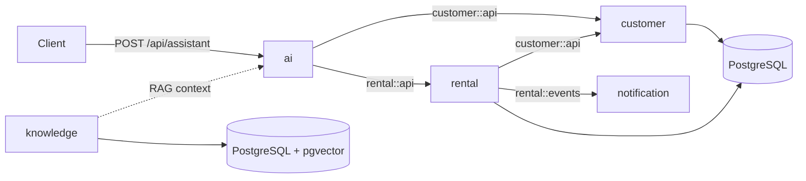

# Fleet Agent

Backend for a vehicle rental company featuring an AI assistant capable of handling customer interactions, querying data, and executing real application use cases.

The project started as a study of the integration between Java and language models, but evolved into a **modular monolith** with business rules, persistence, RAG, tool calling, internal events, and architecture tests.

> Learning and portfolio project. The application demonstrates real decisions and integrations, but still has planned improvements before it can be used in production.

## What the assistant does

Through a single conversational API, the assistant can:

- answer questions about documents, payments, fuel, insurance, and the rental process;
- calculate quotations by category and number of days;
- list available vehicles by category;
- find or register customers;
- create reservations linked to the customer, vehicle, and conversation session;
- retrieve reservations using the customer's document;
- cancel reservations and make the vehicle available again;
- automatically complete expired reservations and release the vehicle;
- prevent concurrent active reservations for the same vehicle;
- retain the context of the latest messages by `sessionId`;
- cite the source used in answers based on the knowledge base;
- block out-of-domain requests and invalid responses with guardrails;
- publish internal events after a reservation is created or canceled.

Business rules do not live in the prompt. The LLM interprets the intent and chooses a tool, while the Java services validate and execute the operation.

## Architecture

Fleet Agent is a single Spring Boot application organized by business capabilities. Spring Modulith documents the modules, restricts their dependencies, and verifies that there are no cycles.



### Modules

| Module | Responsibility | Contracts and communication |
|---|---|---|
| `ai` | Conversational API, AI Service, models, memory, guardrails, and tools | Consumes only the public interfaces of `customer` and `rental` |
| `customer` | Customer registration, lookup, and business rules | Exposes `customer::api` through a `@NamedInterface` |
| `rental` | Categories, fleet, quotations, and reservation lifecycle | Exposes `rental::api`, consumes `customer::api`, and publishes events |
| `knowledge` | Document ingestion, versioning, and semantic retrieval | Provides the RAG infrastructure and has no domain dependencies |
| `notification` | Reacts to events from the rental module | Consumes `rental::events` after the transaction commits |

Each module maintains its own API, application, domain, and persistence packages as needed. Internal implementations are not used as contracts between modules.

### Synchronous and event-based communication

Queries and validations required to complete an operation use synchronous Java contracts. For example, a reservation queries the customer through `customer::api` before it is created.

Subsequent effects use Spring events:

```text
Reservation created/canceled
  -> transaction committed
  -> ReservationCreatedEvent or ReservationCancelledEvent
  -> ReservationNotificationListener (AFTER_COMMIT)
```

This flow keeps the reservation core decoupled from notifications without introducing Kafka or other distributed infrastructure into a monolith.

## Conversation flow

```text
Client
  -> POST /api/assistant
  -> AssistantAiController
  -> AssistantAiService
     -> session memory
     -> input guardrail
     -> RAG context retrieval
     -> chat model (Ollama or Gemini)
     -> tool, when required
        -> public module contract
        -> application service
        -> domain and database
     -> output guardrail
  -> response + sessionId
```

## AI integration

### AI Service and memory

The AI Service uses `@SystemMessage`, `@UserMessage`, and `@MemoryId`. When the first request does not contain a session, the API generates a UUID and returns it to the client.

Memory is isolated by session and uses `MessageWindowChatMemory` with the ten most recent messages. It is currently stored in memory and is lost when the application restarts.

### Tool calling

The tools are adapters between the LLM and the application's public contracts:

| Group | Available operations |
|---|---|
| Customer service | Calculate quotations and list available vehicles |
| Customers | Find a customer by document and register a customer |
| Reservations | Create, retrieve, and cancel a reservation |

When a reservation is created, `@ToolMemoryId` injects the conversation identifier into the operation. The backend remains responsible for validating dates, customer existence, vehicle availability, reservation ownership, and status transitions.

The flow uses a short pessimistic lock on the vehicle during creation and a PostgreSQL partial constraint as the final safeguard against concurrent active reservations. Repeated calls are idempotent only for active reservations with the same session, customer, vehicle, and period. An internal job completes expired reservations at the interval configured by `RESERVATION_COMPLETION_INTERVAL`, without involving the AI.

### Guardrails

The input guardrail blocks known prompt injection attempts and questions that are clearly outside the application's scope. The output guardrail prevents an empty response from being returned to the client.

There are isolated tests for valid inputs, manipulation attempts, out-of-domain subjects, and invalid responses.

## RAG and knowledge base

The Markdown documents are stored in `src/main/resources/knowledge`:

- `politica-combustivel.md`;
- `politica-documentos.md`;
- `politica-pagamentos.md`;
- `politica-seguros.md`;
- `processo-locacao.md`.

Ingestion pipeline:

```text
Markdown document
  -> metadata and SHA-256 hash
  -> recursive split into 300-character chunks
  -> 30-character overlap
  -> embeddings with nomic-embed-text
  -> storage in pgvector
```

Retrieval pipeline:

```text
Customer question
  -> query embedding
  -> cosine similarity search
  -> up to 3 chunks with a minimum score of 0.65
  -> context + source + title + category
  -> grounded response with a source citation
```

The hash prevents documents that have not changed from being reindexed. When the content changes, the old embeddings for that source are removed before the new ingestion.

## Stack

- Java 25;
- Spring Boot 3.5;
- Spring Modulith;
- LangChain4j;
- Ollama with `llama3.2` for local chat;
- Google Gemini as an optional provider;
- Ollama with `nomic-embed-text` for embeddings;
- PostgreSQL 17 with pgvector;
- Spring Data JPA;
- Flyway;
- Spring Boot Actuator;
- Maven;
- JUnit 5, AssertJ, and Mockito.

## Running locally

### Requirements

- JDK 25;
- Docker and Docker Compose;
- Ollama.

Confirm the Java version:

```bash
java -version
```

### 1. Start PostgreSQL with pgvector

```bash
docker compose -f src/main/docker/docker-compose.yml up -d
```

Default configuration:

```text
host: localhost
port: 5433
database: fleet_agent
user: fleet_agent
password: fleet_agent
```

The data is stored in the `fleet-agent-postgres-data` Docker volume.

### 2. Prepare the local models

```bash
ollama pull llama3.2
ollama pull nomic-embed-text
ollama serve
```

If Ollama is already running as a service, the last command is not required.

### 3. Start the application

```bash
./mvnw spring-boot:run
```

If you need to explicitly point to JDK 25:

```bash
JAVA_HOME=/home/youx/.sdkman/candidates/java/25.0.3-tem ./mvnw spring-boot:run
```

On startup, Flyway updates the schema and the knowledge base is ingested only when its documents are new or have changed.

### Using Gemini

Ollama is the default provider. To use Gemini:

```bash
export APP_AI_PROVIDER=gemini
export GEMINI_API_KEY=your-key
export GEMINI_MODEL=gemini-3.1-flash-lite
./mvnw spring-boot:run
```

No real key should be added to `application.yaml` or committed to the repository.

## Conversational API

### Start a conversation

```bash
curl -X POST http://localhost:8080/api/assistant \
  -H "Content-Type: application/json" \
  -d '{
    "message": "Which documents do I need to provide to rent a car?"
  }'
```

Response:

```json
{
  "sessionId": "generated-uuid",
  "answer": "..."
}
```

### Continue the same conversation

```bash
curl -X POST http://localhost:8080/api/assistant \
  -H "Content-Type: application/json" \
  -d '{
    "sessionId": "paste-the-uuid-here",
    "message": "I want to see the available SUVs"
  }'
```

The `message` field is required and accepts a maximum of 1,000 characters.

### Example journeys

```text
How much does an SUV cost for 5 days?
```

```text
Which economy vehicles are available?
```

```text
I want to make a reservation.
```

```text
Retrieve my reservation using document number 00000000000.
```

```text
I want to cancel reservation 00000000-0000-0000-0000-000000000000.
```

The assistant asks only for the missing data before calling a backend operation.

## Persistence and migrations

Hibernate is configured with `ddl-auto: validate`. Database evolution is managed exclusively by Flyway.

| Version | Migration | Responsibility |
|---|---|---|
| V1 | `create_rental_category` | Creates categories and base prices; inserts economy, SUV, and premium |
| V2 | `enable_pgvector` | Enables the `vector` extension |
| V3 | `create_knowledge_embeddings` | Creates `vector(768)` embeddings, metadata, and an IVFFlat index |
| V4 | `create_knowledge_documents` | Tracks source, category, hash, and ingestion date |
| V5 | `create_car` | Creates the fleet and its relationship with categories |
| V6 | `create_reservation` | Creates reservations related to a vehicle and session |
| V7 | `insert_cars` | Inserts the initial fleet for the three categories |
| V8 | `create_customer` | Creates customers with a unique document |
| V9 | `add_customer_to_reservation` | Associates reservations with customers |
| V10 | `add_status_to_reservation` | Adds the reservation status |
| V11 | `harden_reservation_consistency` | Protects the period, vehicle identity, and active-reservation uniqueness |

An applied migration must not be edited. New schema changes must be added in a new version.

## Tests and architecture documentation

Run the test suite:

```bash
./mvnw test
```

With a specific Java version:

```bash
JAVA_HOME=/home/youx/.sdkman/candidates/java/25.0.3-tem ./mvnw test
```

The current suite covers:

- quotation rules;
- reservation creation, retrieval, and cancellation;
- expected effects on the vehicle and repository;
- publication of reservation events;
- automatic completion of expired reservations;
- idempotency and deterministic active-reservation retrieval;
- PostgreSQL persistence invariants verified with Testcontainers;
- error scenarios without unintended persistence or events;
- input and output guardrails;
- basic application loading;
- architectural boundaries of the modular monolith.

The modularity test executes:

```java
ApplicationModules.of(FleetAgentApplication.class).verify();
```

To generate PlantUML diagrams for the modules:

```bash
./mvnw -Dtest=DocumentationTest test
```

Spring Modulith's `Documenter` writes the general diagram and individual module diagrams to `target/spring-modulith-docs`.

## Health check

```bash
curl http://localhost:8080/actuator/health
```

In addition to Spring's standard indicators, the project has a `rag` health indicator. It performs an actual retrieval from the vector store and helps detect problems with the embedding model, pgvector, ingestion, or retriever configuration.

## Main structure

```text
src/main/java/io/github/pedrodevsi/fleetagent
├── ai
│   ├── api
│   ├── application
│   ├── config
│   ├── dto
│   ├── guardrail
│   └── tools
├── customer
│   ├── api
│   ├── application
│   ├── domain
│   └── repository
├── knowledge
│   ├── application
│   ├── config
│   ├── dto
│   ├── infra
│   ├── ingestion
│   └── utils
├── notification
│   └── application
└── rental
    ├── api
    │   └── event
    ├── application
    ├── domain
    └── repository
```

## Common problems

### Failed to connect to Ollama

```text
Connection refused: localhost:11434
```

Start the service with `ollama serve` and confirm that the models have been downloaded.

### Embedding model not found

```bash
ollama pull nomic-embed-text
```

### pgvector dimension error

The `nomic-embed-text` model used by the project generates 768-dimensional vectors. The property below and the column created by migration V3 must remain compatible:

```yaml
rag.vector-store.dimension: 768
```

### Flyway validation failed

If Flyway reports a checksum difference, an already applied migration has been modified. Restore its original content and create a new migration for the required change.

### RAG health check is `DOWN`

Check:

- whether PostgreSQL and Ollama are available;
- whether `nomic-embed-text` has been downloaded;
- whether the migrations have been applied;
- whether the knowledge base has been indexed;
- whether `minScore` is appropriate for the documents.

## Current limitations and next steps

- conversation memory is still local and does not persist across restarts;
- the notification module currently logs events only;
- authentication and authorization have not yet been implemented;
- observability for LLM calls, tokens, tools, and RAG quality is planned;
- the guardrails can evolve into a broader prompt injection protection strategy;
- integration tests with PostgreSQL, pgvector, and real models can expand the current coverage.

These points are kept explicit to distinguish what already works from the next stages of learning and technical evolution.

## Security

- do not commit keys, real passwords, or `.env` files;
- configure credentials through environment variables;
- keep business rules and validations in the backend, never only in the prompt;
- handle personal data before logging prompts, responses, or tool arguments;
- do not treat the document provided in the conversation as sufficient authentication in production.
