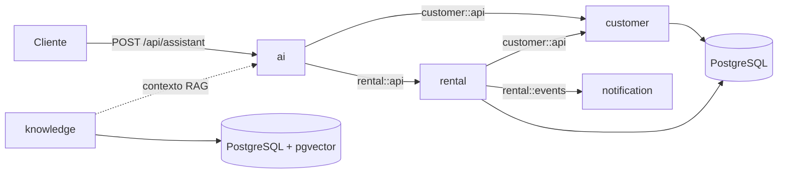

# Fleet Agent

Backend de uma locadora de veículos com um assistente de IA capaz de conduzir atendimentos, consultar dados e executar casos de uso reais da aplicação.

O projeto nasceu como estudo de integração entre Java e modelos de linguagem, mas evoluiu para um **monólito modular** com regras de negócio, persistência, RAG, tool calling, eventos internos e testes de arquitetura.

> Projeto de aprendizado e portfólio. A aplicação demonstra decisões e integrações reais, mas ainda possui evoluções planejadas antes de um uso em produção.

## O que o assistente faz

Por meio de uma única API conversacional, o assistente consegue:

- responder dúvidas sobre documentos, pagamentos, combustível, seguros e processo de locação;
- calcular cotações por categoria e quantidade de dias;
- listar veículos disponíveis por categoria;
- localizar ou cadastrar clientes;
- criar reservas vinculadas ao cliente, veículo e sessão da conversa;
- consultar reservas pelo documento do cliente;
- cancelar reservas e disponibilizar novamente o veículo;
- manter o contexto das últimas mensagens por `sessionId`;
- citar a fonte usada nas respostas baseadas na base de conhecimento;
- bloquear solicitações fora do domínio e respostas inválidas com guardrails;
- publicar eventos internos após a criação ou o cancelamento de uma reserva.

As regras de negócio não ficam no prompt. A LLM interpreta a intenção e escolhe uma tool, enquanto os serviços Java validam e executam a operação.

## Arquitetura

O Fleet Agent é uma única aplicação Spring Boot organizada por capacidades de negócio. O Spring Modulith documenta os módulos, restringe suas dependências e verifica a ausência de ciclos.



### Módulos

| Módulo | Responsabilidade | Contratos e comunicação |
|---|---|---|
| `ai` | API conversacional, AI Service, modelos, memória, guardrails e tools | Consome apenas as interfaces públicas de `customer` e `rental` |
| `customer` | Cadastro, consulta e regras do cliente | Expõe `customer::api` por uma `@NamedInterface` |
| `rental` | Categorias, frota, cotação e ciclo de vida das reservas | Expõe `rental::api`, consome `customer::api` e publica eventos |
| `knowledge` | Ingestão, versionamento e recuperação semântica dos documentos | Fornece a infraestrutura de RAG e permanece sem dependências de domínio |
| `notification` | Reação a acontecimentos do módulo de locação | Consome `rental::events` após o commit da transação |

Cada módulo mantém seus próprios pacotes de API, aplicação, domínio e persistência conforme a necessidade. Implementações internas não são usadas como contrato entre módulos.

### Comunicação síncrona e por eventos

Consultas e validações necessárias para concluir uma operação usam contratos Java síncronos. Por exemplo, uma reserva consulta o cliente por `customer::api` antes de ser criada.

Efeitos posteriores usam eventos do Spring:

```text
Reserva criada/cancelada
  -> transação confirmada
  -> ReservationCreatedEvent ou ReservationCancelledEvent
  -> ReservationNotificationListener (AFTER_COMMIT)
```

Esse fluxo mantém o núcleo da reserva desacoplado da notificação sem introduzir Kafka ou outra infraestrutura distribuída em um monólito.

## Fluxo de uma conversa

```text
Cliente
  -> POST /api/assistant
  -> AssistantAiController
  -> AssistantAiService
     -> memória da sessão
     -> guardrail de entrada
     -> recuperação de contexto no RAG
     -> modelo de chat (Ollama ou Gemini)
     -> tool, quando necessária
        -> contrato público do módulo
        -> serviço de aplicação
        -> domínio e banco de dados
     -> guardrail de saída
  -> resposta + sessionId
```

## Integração com IA

### AI Service e memória

O AI Service usa `@SystemMessage`, `@UserMessage` e `@MemoryId`. Quando a primeira requisição não contém uma sessão, a API gera um UUID e o devolve ao cliente.

A memória é isolada por sessão e usa `MessageWindowChatMemory` com as dez mensagens mais recentes. Atualmente ela fica em memória e é perdida quando a aplicação reinicia.

### Tool calling

As tools são adaptadores entre a LLM e os contratos públicos da aplicação:

| Grupo | Operações disponíveis |
|---|---|
| Atendimento | calcular cotação e listar veículos disponíveis |
| Clientes | consultar cliente por documento e cadastrar cliente |
| Reservas | criar, consultar e cancelar reserva |

Na criação de reserva, o `@ToolMemoryId` injeta o identificador da conversa na operação. O backend continua responsável por validar datas, existência do cliente, disponibilidade do veículo, propriedade da reserva e transições de status.

### Guardrails

O guardrail de entrada bloqueia tentativas conhecidas de prompt injection e perguntas claramente fora do escopo. O guardrail de saída impede que uma resposta vazia seja devolvida ao cliente.

Há testes isolados para entradas válidas, tentativas de manipulação, assuntos fora do domínio e respostas inválidas.

## RAG e base de conhecimento

Os documentos Markdown ficam em `src/main/resources/knowledge`:

- `politica-combustivel.md`;
- `politica-documentos.md`;
- `politica-pagamentos.md`;
- `politica-seguros.md`;
- `processo-locacao.md`.

Pipeline de ingestão:

```text
Documento Markdown
  -> metadados e hash SHA-256
  -> divisão recursiva em chunks de 300 caracteres
  -> sobreposição de 30 caracteres
  -> embeddings com nomic-embed-text
  -> armazenamento no pgvector
```

Pipeline de recuperação:

```text
Pergunta do cliente
  -> embedding da consulta
  -> busca por similaridade de cosseno
  -> até 3 chunks com score mínimo de 0.65
  -> contexto + source + title + category
  -> resposta fundamentada com citação da fonte
```

O hash evita reindexar documentos que não mudaram. Quando o conteúdo é alterado, os embeddings antigos daquela fonte são removidos antes da nova ingestão.

## Stack

- Java 25;
- Spring Boot 3.5;
- Spring Modulith;
- LangChain4j;
- Ollama com `llama3.2` para chat local;
- Google Gemini como provedor opcional;
- Ollama com `nomic-embed-text` para embeddings;
- PostgreSQL 17 com pgvector;
- Spring Data JPA;
- Flyway;
- Spring Boot Actuator;
- Maven;
- JUnit 5, AssertJ e Mockito.

## Executando localmente

### Requisitos

- JDK 25;
- Docker e Docker Compose;
- Ollama.

Confirme a versão do Java:

```bash
java -version
```

### 1. Suba o PostgreSQL com pgvector

```bash
docker compose -f src/main/docker/docker-compose.yml up -d
```

Configuração padrão:

```text
host: localhost
port: 5433
database: fleet_agent
user: fleet_agent
password: fleet_agent
```

Os dados ficam no volume Docker `fleet-agent-postgres-data`.

### 2. Prepare os modelos locais

```bash
ollama pull llama3.2
ollama pull nomic-embed-text
ollama serve
```

Se o Ollama já estiver rodando como serviço, o último comando não é necessário.

### 3. Inicie a aplicação

```bash
./mvnw spring-boot:run
```

Se for necessário apontar explicitamente para o JDK 25:

```bash
JAVA_HOME=/home/youx/.sdkman/candidates/java/25.0.3-tem ./mvnw spring-boot:run
```

Na inicialização, o Flyway atualiza o schema e a base de conhecimento é ingerida apenas quando seus documentos são novos ou foram alterados.

### Usando Gemini

Ollama é o provider padrão. Para usar Gemini:

```bash
export APP_AI_PROVIDER=gemini
export GEMINI_API_KEY=sua-chave
export GEMINI_MODEL=gemini-3.1-flash-lite
./mvnw spring-boot:run
```

Nenhuma chave real deve ser adicionada ao `application.yaml` ou versionada no repositório.

## API conversacional

### Iniciar uma conversa

```bash
curl -X POST http://localhost:8080/api/assistant \
  -H "Content-Type: application/json" \
  -d '{
    "message": "Quais documentos preciso apresentar para alugar um carro?"
  }'
```

Resposta:

```json
{
  "sessionId": "uuid-gerado",
  "answer": "..."
}
```

### Continuar a mesma conversa

```bash
curl -X POST http://localhost:8080/api/assistant \
  -H "Content-Type: application/json" \
  -d '{
    "sessionId": "cole-o-uuid-aqui",
    "message": "Quero ver os SUVs disponíveis"
  }'
```

O campo `message` é obrigatório e aceita no máximo 1.000 caracteres.

### Exemplos de jornadas

```text
Quanto custa um SUV por 5 dias?
```

```text
Quais veículos econômicos estão disponíveis?
```

```text
Quero fazer uma reserva.
```

```text
Consulte minha reserva pelo CPF 00000000000.
```

```text
Quero cancelar a reserva 00000000-0000-0000-0000-000000000000.
```

O assistente solicita somente os dados que ainda faltam antes de chamar uma operação do backend.

## Persistência e migrations

O Hibernate está configurado com `ddl-auto: validate`. A evolução do banco pertence exclusivamente ao Flyway.

| Versão | Migration | Responsabilidade |
|---|---|---|
| V1 | `create_rental_category` | Cria categorias e preços base; insere econômico, SUV e premium |
| V2 | `enable_pgvector` | Habilita a extensão `vector` |
| V3 | `create_knowledge_embeddings` | Cria embeddings `vector(768)`, metadados e índice IVFFlat |
| V4 | `create_knowledge_documents` | Controla fonte, categoria, hash e data de ingestão |
| V5 | `create_car` | Cria a frota e sua relação com categorias |
| V6 | `create_reservation` | Cria reservas relacionadas a veículo e sessão |
| V7 | `insert_cars` | Insere a frota inicial das três categorias |
| V8 | `create_customer` | Cria clientes com documento único |
| V9 | `add_customer_to_reservation` | Relaciona reservas aos clientes |
| V10 | `add_status_to_reservation` | Adiciona o estado da reserva |

Uma migration aplicada não deve ser editada. Novas alterações de schema devem ser adicionadas em uma nova versão.

## Testes e documentação da arquitetura

Execute a suíte:

```bash
./mvnw test
```

Com um Java específico:

```bash
JAVA_HOME=/home/youx/.sdkman/candidates/java/25.0.3-tem ./mvnw test
```

A suíte atual cobre:

- regras de cotação;
- criação, consulta e cancelamento de reservas;
- efeitos esperados no veículo e no repositório;
- publicação dos eventos de reserva;
- cenários de erro sem persistência ou evento indevido;
- guardrails de entrada e saída;
- carregamento básico da aplicação;
- limites arquiteturais do monólito modular.

O teste de modularidade executa:

```java
ApplicationModules.of(FleetAgentApplication.class).verify();
```

Para gerar os diagramas PlantUML dos módulos:

```bash
./mvnw -Dtest=DocumentationTest test
```

O `Documenter` do Spring Modulith grava o diagrama geral e os diagramas individuais em `target/spring-modulith-docs`.

## Health check

```bash
curl http://localhost:8080/actuator/health
```

Além dos indicadores padrão do Spring, o projeto possui o health indicator `rag`. Ele executa uma recuperação real na base vetorial e ajuda a detectar problemas no modelo de embeddings, pgvector, ingestão ou configuração do retriever.

## Estrutura principal

```text
src/main/java/io/github/pedrodevsi/fleetagent
├── ai
│   ├── api
│   ├── application
│   ├── config
│   ├── dto
│   ├── guardrail
│   └── tools
├── customer
│   ├── api
│   ├── application
│   ├── domain
│   └── repository
├── knowledge
│   ├── application
│   ├── config
│   ├── dto
│   ├── infra
│   ├── ingestion
│   └── utils
├── notification
│   └── application
└── rental
    ├── api
    │   └── event
    ├── application
    ├── domain
    └── repository
```

## Problemas comuns

### Falha ao conectar no Ollama

```text
Connection refused: localhost:11434
```

Inicie o serviço com `ollama serve` e confirme se os modelos foram baixados.

### Modelo de embedding não encontrado

```bash
ollama pull nomic-embed-text
```

### Erro de dimensão no pgvector

O `nomic-embed-text` usado pelo projeto gera vetores com 768 dimensões. A propriedade abaixo e a coluna criada pela migration V3 precisam continuar compatíveis:

```yaml
rag.vector-store.dimension: 768
```

### Validação do Flyway falhou

Se o Flyway informar diferença de checksum, uma migration já aplicada foi alterada. Restaure o conteúdo original e crie uma nova migration para a mudança necessária.

### Health check do RAG está `DOWN`

Verifique:

- se PostgreSQL e Ollama estão disponíveis;
- se `nomic-embed-text` foi baixado;
- se as migrations foram aplicadas;
- se a base de conhecimento foi indexada;
- se o `minScore` está adequado aos documentos.

## Limitações atuais e próximos passos

- a memória de conversa ainda é local e não persiste após reinicializações;
- o módulo de notificação atualmente registra eventos em log;
- autenticação e autorização ainda não foram implementadas;
- observabilidade de chamadas à LLM, tokens, tools e qualidade do RAG está planejada;
- os guardrails podem evoluir com uma estratégia mais ampla de proteção contra prompt injection;
- testes de integração com PostgreSQL, pgvector e modelos reais podem ampliar a cobertura atual.

Esses pontos são mantidos explícitos para separar o que já funciona das próximas etapas de aprendizado e evolução técnica.

## Segurança

- não versione chaves, senhas reais ou arquivos `.env`;
- configure credenciais por variáveis de ambiente;
- mantenha regras de negócio e validações no backend, nunca apenas no prompt;
- trate dados pessoais antes de registrar prompts, respostas ou argumentos das tools;
- não considere o documento informado na conversa como autenticação suficiente em produção.
