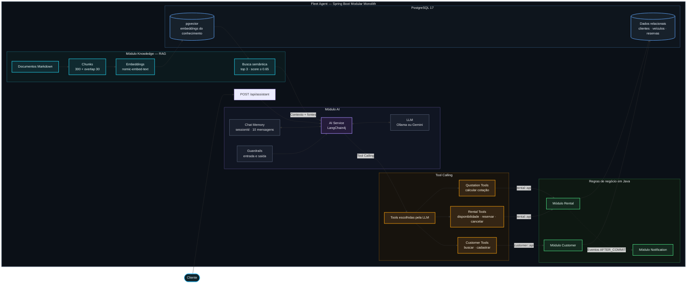

# Fluxo de IA — Fleet Agent

O diagrama destaca o fluxo de inteligência artificial do projeto. A locadora funciona como o cenário de negócio no qual o LangChain4j combina contexto conversacional, RAG e chamadas de ferramentas, mantendo as regras e alterações de estado sob responsabilidade do backend Java.

## Leitura do fluxo

1. O cliente envia uma mensagem para a API do assistente.
2. O AI Service combina o histórico da sessão, os guardrails e o modelo configurado.
3. O módulo Knowledge recupera contexto semântico no PGVector e devolve os trechos relevantes com suas fontes.
4. Quando a intenção exige uma operação, a LLM seleciona uma tool.
5. A tool chama um contrato público dos módulos Java; ela não implementa a regra de negócio.
6. Customer e Rental validam e persistem as alterações no PostgreSQL.
7. Mudanças em reservas geram eventos internos consumidos pelo módulo Notification após o commit.

> A LLM interpreta a intenção e escolhe ferramentas. O backend Java continua sendo a autoridade sobre regras, validações e estado do sistema.
